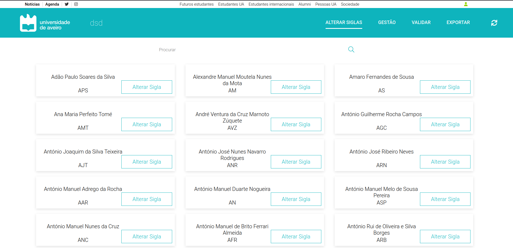

# Cartões com docentes

A página em questão contém diversos docentes apresentados, sendo que o nome e a sigla de cada um se encontra dentro de um *card*.



```bash
<Card
    key={name}
    name={name}
    acronym={acronym}
    onClick={() => changeModalVisibility(name, acronym, id)}
/>
```

Este cartão para além de conter o nome e sigla de um docente, possui tambémm um botão que ao ser selecionado abrirá um *pop-up* onde a sigla do docente poderá ser alterada.