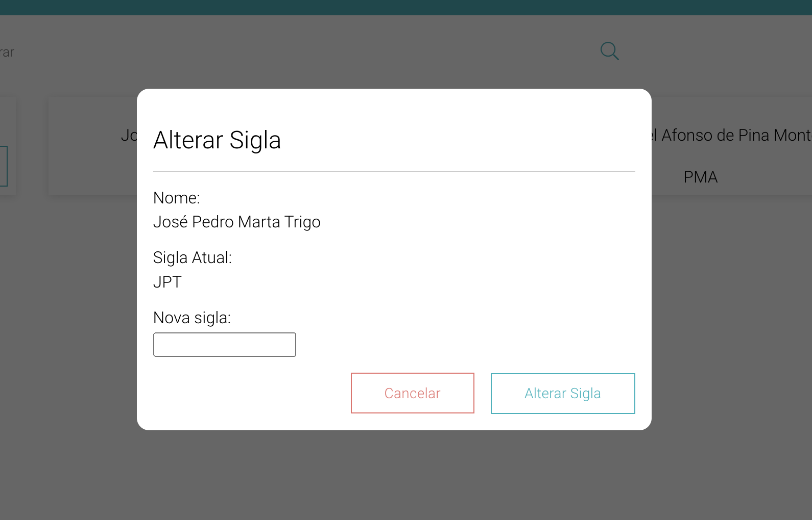

# Modal para alterar siglas

Este componente encontra-se em diversas partes da plataforma mas neste caso, especificamente, é relativo á alteração da sigla de um docente.



```bash
<Modal changeModal={hideModal}>
    <ChangeAcronymContent
        //class="no-overflow"
        name={name}
        acronym={acronym}
        id={id}
        info={info}
        acronymChanged={acronymChanged}
        changeModal={changeModalVisibility}
    />
</Modal>
```

A *Modal* é o *pop-up* que aparece no ecrã do utilizador. Já o *ChangeAcronymContent* é especifico para este caso. Este possui diversas informações relativas ao docente, além de ter também duas funções:
- *acronymChanged*: função que altera o mapa que possui os pares *docente:sigla*;
- *changeModal*: função chamada para alterar a visibilidade da *modal*.

Ao introduzir uma nova sigla e selecionar o botão *Alterar Sigla*, a sigla do docente em questão será alterada para a nova introduzida. Ao clicar em *Cancelar*, o *pop-up* é fechado.