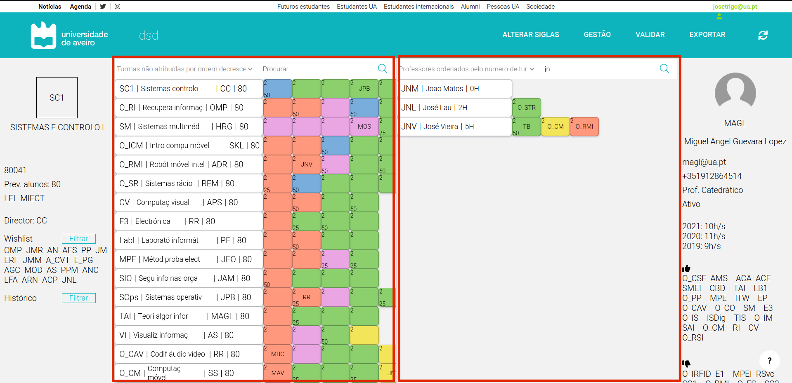

# Painel Principal

O painel principal é a parte central do problema da distribuição do serviço docente.<br/>
A página é composta por dois destes paineis, sendo que um é referente ás unidades curriculares e outro em relação aos docentes.



```bash
<MainPanel 
    searchOnChange={} 
    onSelectChange={handleSelectChange} 
    selectOptions={[]} 
    filtersValues={[]}>
</MainPanel>
```

Para os dois casos os dados passados ao componente são similares:
- *searchOnChange*: refere-se á função a ser chamada quando o utilizador insere caracteres na barra de pesquisa do painel (em cada caso, uma função específica é executada);
- *onSelectChange*: quando o utilizador altera os filtros do painel, a função em evidência é executada;
- *selectOptions* e *filtersValues*: opções e seus respetivos valores que são utilizados na parte dos filtros de cada painel. 

Além disso, uma das partes mais importantes deste componente é o que ele recebe como *children*. Estes são referentes ás células de cada UC, de cada docente e de cada turma.
