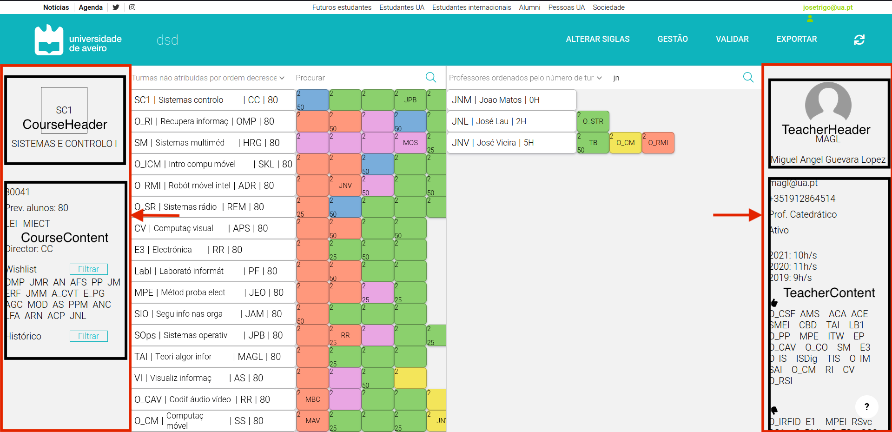

# Painel Lateral

Na página principal existe também os paineis laterais que foram criados com o propósito de mostrar informações adicionais acerca de determinadas unidades curriculares ou determinados docentes.



Cada um dos paineis é composto por dois outros componentes:
- CourseHeader/TeacherHeader: refere-se ao *header* de cada painel (nome completo do(a) docente/UC e sigla do(a) docente/UC).
```bash
<CourseHeader key={acronym} acronym={acronym} name={name} />
<TeacherHeader key={acronym} acronym={acronym} name={name}/>
```
- CourseContent/TeacherContent: refere-se ao conteúdo do painel contendo diversas outras informações tanto para docentes como para unidades curriculares.
```bash
<CourseContent
    key={id}
    studentsEstimate={studentsEstimate}
    id={id}
    director={direct}
    wishlist={wishlist}
    filter={loadProfsCells}/>
<TeacherContent
    key={id}
    email={email}
    phone={phone}
    rank={rank} 
    situation={situation}
    wishLikes={wishLikes}
    wishDislikes={wishDislikes}/>
```
O *CourseContent* tem informações relativas ao código da UC, o regente, a lista de docentes que gostavam de lecionar a unidade curricular bem como ainda especifica uma função cujo objetivo é filtrar os docentes que gostavam de lecionar a UC.<br/>
O *TeacherContent* possui dados acerca do e-mail, número de telemóvel, estatuto, situação do docente, lista de UC's que gostava e não gostava de lecionar.

# Mudança de UC/docente nos paineis laterais

Para alterar a unidade curricular ou o docente que se está a visualizar nos paineis laterais, basta selecionar outra UC ou outro docente no painel principal.
Ao fazer esta seleção, uma função é chamada para os dois casos, em que o objetivo é obter as informações acerca do objeto selecionado.<br/>
No caso das unidades curriculares a função chamada é a abaixo mostrada.
```bash
const displayUcInSidePanel = () => { // display Uc information in sidePanel
    let result: any = [];
    let wishlist: any = [];
    var direct = "";

    if (ucCellClicked == ucInfo[0].id) {
      result.push(<CourseHeader key={ucInfo[0].acronym} acronym={ucInfo[0].acronym} name={ucInfo[0].name} />);
      Array.from(ucWishlist.entries()).map((entry: any) => {
        const [k, v] = entry;
        if (v.preference == "likes") {
          for(var key in profsIds){
            if (profsIds[key] === v.professorID) {
              wishlist.push(key);
            }
          }
        }
      });
      for(var key in profsIds){
        if (profsIds[key] == ucInfo[0].regentID) {
          direct = key;
        }
      }
      result.push(
        <CourseContent
          key={ucInfo[0].id}
          studentsEstimate={ucInfo[0].studentsEstimate}
          id={ucInfo[0].id}
          director={direct}
          wishlist={wishlist}
          filter={loadProfsCells}/>
      );
    }

    return <div>{result}</div>;
}
```

Em relação ás informações adicionais dos docentes, a função executada é a seguinte.
```bash
const displayTeacherInSidePanel = () => { // display teacher information in sidePanel
    let result: any = [];
    let wishLikes: any = [];
    let wishDislikes: any = [];

    if (profCellClicked == teacherInfo[0].id) {
      result.push(<TeacherHeader key={teacherInfo[0].acronym} acronym={teacherInfo[0].acronym} name={teacherInfo[0].name}/>);
      Array.from(profWishlist.entries()).map((entry: any) => {
        const [k, v] = entry;
        ucsIds.forEach((val: any, key: any) => {
          if (val == v.ucID) {
            if (v.preference == "likes") wishLikes.push(key);
            else if (v.preference == "dislikes") wishDislikes.push(key);
          }
        });
      });
      result.push(
        <TeacherContent
          key={teacherInfo[0].id}
          email={teacherInfo[0].email}
          phone={teacherInfo[0].phone}
          rank={teacherInfo[0].rank} 
          situation={teacherInfo[0].situation}
          wishLikes={wishLikes}
          wishDislikes={wishDislikes}
        />
      );
    }

    return <div>{result}</div>;
}
```