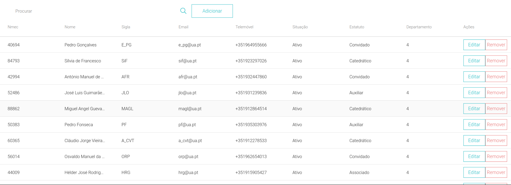

# Tabela

O componente principal desta página é a tabela que permite ter uma visão de todos os dados.
A tabela utilizada pertence à *library* [**ag-grid-react**](https://www.ag-grid.com/react-data-grid/getting-started/).
Nela são apresentados os dados relativos a cada tipo de vista, sendo de notar a última coluna, *Ações*.



O componente *ButtonsWrapper* representa uma *div* através de *styled-component* que serve basicamente para ajustar a localização dos 2 botões na tabela.

```js
const ButtonsWrapper = styled.div`
  display: flex;
  justify-content: space-between;
  height: 100%;
  align-items: center;
`;

<ButtonsWrapper>
    <Button
        style={{ height: "2rem", width: "20%" }}
        primary
        onClick={() => handleEdit(params.data)}
    >
        Editar
    </Button>
    <Button
        style={{ height: "2rem", width: "20%" }}
        danger
        onClick={
            () => handleDelete(params.value, "/professors?id=")
        }
    >
        Remover
    </Button>
</ButtonsWrapper>
```

Através do botão de **editar** é possível editar os dados referentes a essa linha na tabela, manualmente, executando a função **handleEdit()** que atualiza os dados na base de dados.

No caso do botão de *remover* é executada a função **handleDelete()**, que executa um pedido de **DELETE** na base de dados.

```js
const handleDelete = (id: any, url: string) => {
const requestOptions = {
    method: "DELETE",
    headers: { 
        "Content-Type": "application/json", 
        Authorization: `Bearer ${getWithExpiry("id_token")}` 
    },
};
fetch(process.env.REACT_APP_API_URL + url + id, requestOptions)
    .then((response) => getInfo())
    .then((data) => console.log(data))
    .catch((err) => console.log(err));
};
```