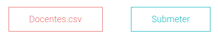

# Botão Escolher Ficheiro

Para além de adicionar ficheiros manualmente é também permitido adicionar dados a partir de um ficheiro CSV. Para isso é necessário escolher os dados que se prentendem inserir, docentes, turmas ou wishlists, e de seguida selecionar o ficheiro a partir do computador.



Na imagem acima já foi selecionado o ficheiro **Docentes.csv**, pelo que, para finalizar a ação, é apenas necessário clicar em submeter.

```js
<input type="file" id="fileid" onChange={handleFileSelect} hidden />
{
    selectedFile ? <Button danger onClick={() => {
        setSelectedFile(undefined); 
        const file = document.getElementById("fileid") as HTMLInputElement; 
        file.value = '';}}>
        {selectedFile.name}
    </Button> : 
    <Button primary onClick={() => {document.getElementById("fileid")?.click();}}>
        Escolher Ficheiro
    </Button>
}
<Button primary onClick={handleSubmit}>
    Submeter
</Button>
```

Para isto é utilizado um input que está hidden e é verificado se existe algum ficheiro selecionado. Caso exista, é apresentado um botão, presente na story book do PACO, do tipo *danger*, ou seja, vermelho, com o nome do ficheiro selecionado no seu interior. Caso contrário, é apresentado um outro botão, do tipo *primary* com o a mensagem para o utilizador escolher um ficheiro.
Existe ainda o ficheiro para submeter que executa a função **handleSubmit()** que faz um POST para a base dados com os novos dados, dando feedback ao utilizador através de um *toast* no canto superior direito caso a operação falhe.

```js
<ToastContainer
        position="top-right"
        autoClose={3000}
        hideProgressBar={false}
        newestOnTop={false}
        closeOnClick
        rtl={false}
        pauseOnFocusLoss
        draggable
        pauseOnHover
/>

...

toast.error("Não foi selecionado nenhum ficheiro!", {
    position: "top-right",
    autoClose: 3000,
    hideProgressBar: false,
    closeOnClick: true,
    pauseOnHover: true,
    draggable: true,
    progress: undefined,
});
```

Nota: para utilizar o toast de feedback ao utilizador é necessário instalar através do npm/yarn e depois importar.
```js
import { ToastContainer, toast } from "react-toastify";
import "react-toastify/dist/ReactToastify.css";
```