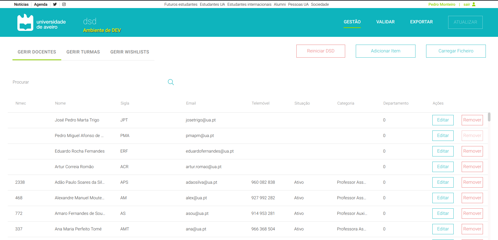

# Secções

Nesta página é possível ter uma visão geral dos dados presentes na plataforma, bem como adicionar novos dados, remover ou alterar os dados existentes.



É permitido selecionar qual a vista que é mostrada, sendo possível observar:
- Lista de Docentes
- Lista de Turmas
- Lista de Wishlists

Estas vistas podem ser selecionadas utilizando o componente referente à lista de opções, que por *default*, apresenta a lista de professores/docentes. Ao clicar num elemento das *tabs* é executada a função *handleChange()* que atualiza o id do item selecionado para que esse seja apresentado.

```js
<Tabs 
    TabIndicatorProps={{sx:{backgroundColor: "#92d400 !important"}}}
    sx={{"& button":{color: "gray !important"}}} 
    value={value} 
    onChange={handleChange} 
    aria-label="basic tabs example">
        { roleID === 0 ? <Tab disableRipple sx={{"& button":{color: "#92d400"}}} label="Gerir Utilizadores" {...a11yProps(0)} />
        :<Tab disableRipple sx={{"& button":{color: "#92d400"}}} label="Gerir Docentes" {...a11yProps(0)} />}
        <Tab disableRipple label="Gerir Turmas" {...a11yProps(1)} />
        <Tab disableRipple label="Gerir Wishlists" {...a11yProps(2)} />
        {roleID === 0 && <Tab disableRipple label="Gerir Departamentos" {...a11yProps(3)} />}
</Tabs>
```

De referir que o componente **Tabs** pertence à livraria Material UI, sendo por isso necessário instalar e importar os componentes a serem utilizados.
Para instalar apenas é necessário correr o comando em baixo (para mais informação visitar o site oficial: https://mui.com/)
```bash
yarn add @mui/material @emotion/react @emotion/styled
```

No início do ficheiro deve ser feito o **import** dos componentes como descrito em baixo.
```js
import Tabs from '@mui/material/Tabs';
import Tab from '@mui/material/Tab';
```