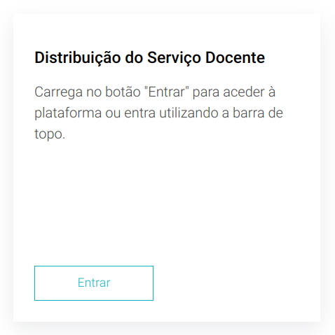
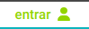

# Login

Através deste componente é possível aceder à aplicação.



Este componente executa a função abaixo, definida na ficheiro **wso2** na pasta **services**, que redireciona para o idp da Universidade de Aveiro.

```js
export const redirectToLogin = (): void => {
  window.location.replace(`${IDP_URI}/authorize?response_type=code
  &client_id=${CLIENT_ID}
  &state=1234567890
  &scope=openid
  &redirect_uri=${REDIRECT_URI}`);
};
```

De notar também que é possível fazer Login na *Universal Bar*, clicando no componente abaixo, que executa a mesma função *redirectToLogin*.



Ao fazer login é possível entrar na aplicação, caso tenha permissões, atualizando o componente na *Universal Bar*.


Para atualizar é verificado se o objeto enviado pelo IDP contém o item **UA_FRIENDLY_NAME**, que corresponde ao nome que o utilizador escolheu para ser representado na Universidade, caso contrário é representado pelo primeiro e último nome (variável user_name).

```js
var name_splited = decoded.name.split(" ");
var user_name = name_splited[0] + " " + name_splited[name_splited.length - 1];
const displayValue: string = 
decoded.hasOwnProperty('UA_Friendly_Name') ? decoded.UA_Friendly_Name 
    : user_name;
dispatch(homeActions.setUserName(displayValue));
```
