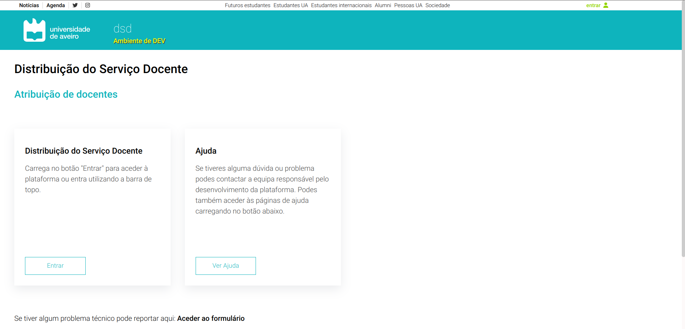

# Página Inicial

Esta é a página que é apresentado ao utilizador ao entrar na aplicação.
Serve apenas para redirecionar o utilizador para dentro da aplicação, caso este esteja corretamente autenticado.



Caso contrário, isto é, o utilizador não tem permissões para aceder à aplicação, é mostrado um *toast* no canto superior direito que informa o utilizador que não consegue aceder à aplicação, redirecionando outra vez para a página inicial.
```js
useEffect(()=>{
    if (location.state && location.state.showToast){
        toast.error("Acesso Restrito!", {
            position: "top-right",
            autoClose: 3000,
            hideProgressBar: false,
            closeOnClick: true,
            pauseOnHover: true,
            draggable: true,
            progress: undefined,
        });
    }
}, []);
```
