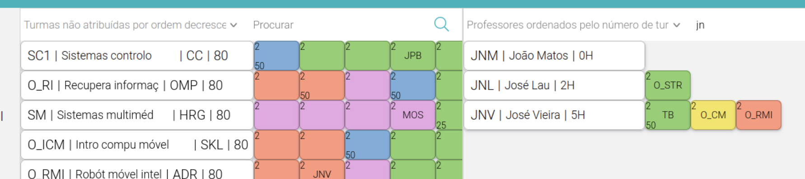

# Ver Turmas Atribuídas a Cada Docente e ver docentes atribuidos a cada UC

A plataforma disponibiliza a funcionalidade de visualizar a que turmas os docentes estão associados bem como os docentes associados a turmas de uma determinada unidade curricular.



Esta secção é composta por dois tipos de células:
- *MainCell/TeacherCell*: célula que contém as informações principais de um(a) UC/docente
```bash
<MainCell
    key={v.ucID}
    f1={v.ucAcronym}
    f2={shortenUcName(v.ucName, 15)}
    f3={v.regentAcronym}
    f4={v.studentsEstimate}
    f5={v.ucID}
    onChildClick={handleChildClick} class={""}/>

<TeacherCell
    key={v[0].professorID}
    class={v[0].professorTotalHours > 8 ? "main-teacher-cell-warning" : "main-teacher-cell"}
    f1={v[0].professorAcronym}
    f2={shortenTeacherName(v[0].professorName)}
    f3={v[0].professorTotalHours + "H"}
    f4={v[0].professorID}
    onChildClick={handleChildClick}/>
```
- *Cell*: célula que representa a turma a que o docente está associado/o docente associado a uma turma de uma UC 
