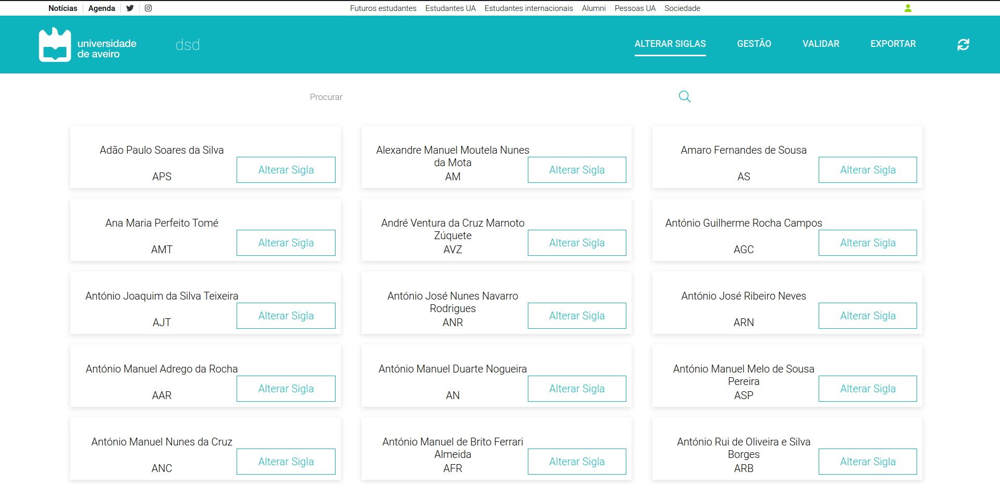

# Alterar Siglas de Docentes

A plataforma DSD permite alterar a sigla dos docentes inseridos pelo utilizador. Para tal, é necessário navegar para a página Alterar Siglas, pesquisar pelo nome do docente cuja sigla deseja alterar e, por fim, clicar no botão Alterar Sigla.



A barra de pesquisa utilizada é um componente do PACO, onde a função **searchBarOnChange** recebe uma *string* que usa para filtrar pelos docentes existentes, mostrando apenas os que contém a *string* fornecida no nome. 
```bash
<SearchBox
  borderColor=""
  defaultValue=""
  iconColor=""
  placeholder="Procurar"
  onSearch={searchBarOnChange}
/>
```

Após a seleção da sigla a alterar aparece uma *modal* que permite fazer essa alteração, onde a função **hideModal** fecha a *modal* e a função **changeModalVisibility** atribui os novos valores e de seguida fecha a *modal*. ChangeAcronymContent é um componente implementado e representa o *card* com os dados.
```bash
<Modal changeModal={hideModal}>
  <ChangeAcronymContent
    name={name}
    acronym={acronym}
    id={id}
    info={info}
    acronymChanged={acronymChanged}
    changeModal={changeModalVisibility}
  />
</Modal>
```