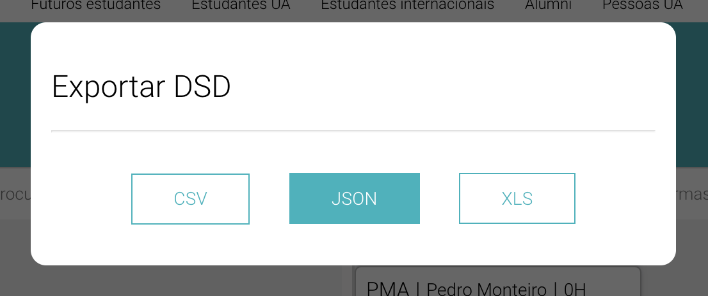
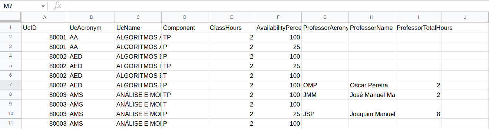
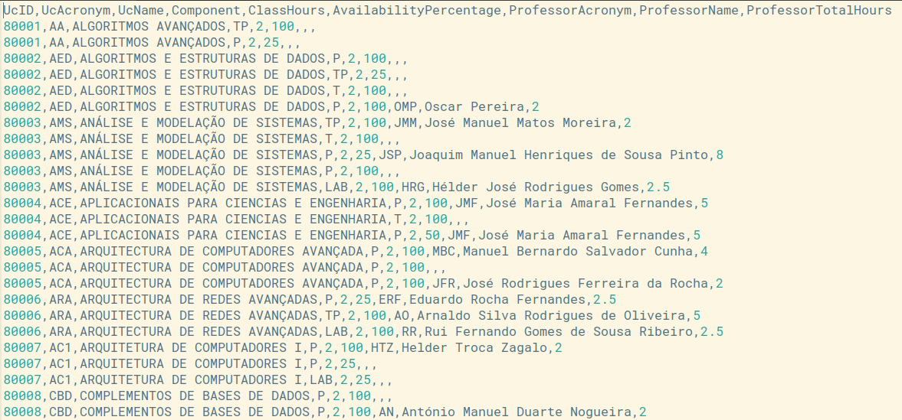
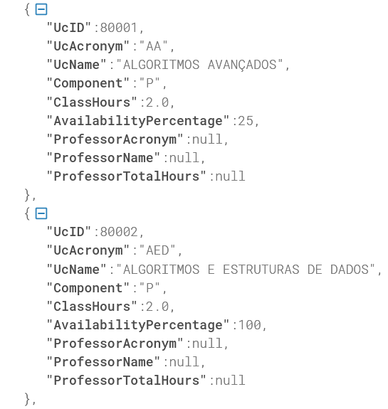

# Exportar para Formatos Comuns

A plataforma DSD permite exportar o estado atual da DSD elaborada pelo utilizador nos seguintes formatos:
- XLS (Excel)
- CSV (Comma Separated Values)
- JSON (Javascript Object Notation)



De maneira semelhante à feature de Validar, também a exportação pode ser feita a qualquer momento, independentemente do estado da DSD, clicando no item **Exportar** na *navbar* da aplicação. É utilizada a função abaixo, onde recebe uma *string* que corresponde ao tipo de ficheiro de *output* pretendido e é feito um pedido *GET* à base de dados que envia o ficheiro escolhido, sendo, por fim, feito o download automático.
```js
const exportDSD = (type: string) => {
    fetch(process.env.REACT_APP_API_URL + `/export?format=` + type, {
        headers: {
        accept: "application/octet-stream",
        Authorization: `Bearer ${getWithExpiry("id_token")}`,
    },
        method: "GET"
    })
    .then((response) => response.blob())
    .then((data) => fileDownload(data, `export.${type}`));
}
```

Em baixo são visíveis exemplos de ficheiros de *output*.
- Excel



- CSV



- JSON



