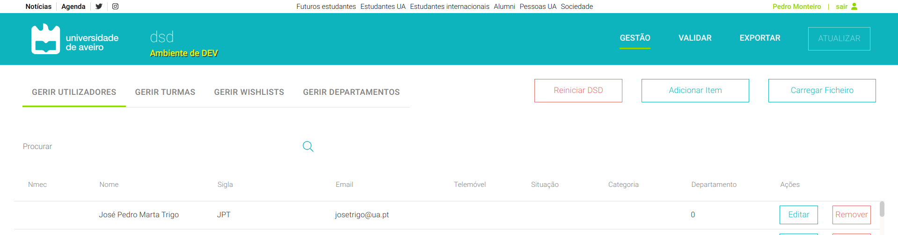
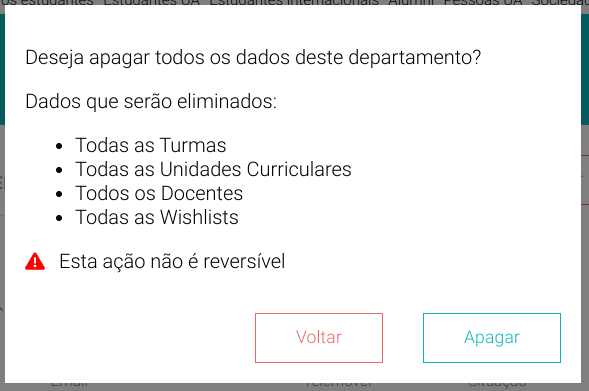

# Reiniciar DSD

A plataforma, na secção de gestão, permite reiniciar a DSD, isto é, repôr o estado inicial, removendo docentes, turmas, unidades curriculares e wishlists criadas. Isto é possível clicando no botão **Reiniciar DSD**.



Ao clicar no botão aparece uma modal que informa o utilizador dos dados a serem apagados e alerta que após remover não é possível voltar atrás.



O botão apagar na *modal* executa a função removeData apresentada abaixo, que basicamente chama o endpoint **/reset_dsd** e executa a operação **DELETE**. Caso haja algum erro o utilizador é informado através de um toast no canto superior direito.
```js
    const removeData = async () => {
        await fetch(window.ENV.REACT_APP_API_URL + `/reset_dsd`, {
            headers: {
                Authorization: `Bearer ${getWithExpiry("id_token")}`,
            },
            method: 'DELETE'
        })
        .then(response => props.onReload())
        .then(() => {
            toast.success(`Todos os dados foram apagados com sucesso!`, {
                position: "top-right",
                autoClose: 3000,
                hideProgressBar: false,
                closeOnClick: true,
                pauseOnHover: true,
                draggable: true,
                progress: undefined,
            });
        }).catch(err => {
            console.error(err);
            toast.error(`Ocorreu um erro!`, {
                position: "top-right",
                autoClose: 3000,
                hideProgressBar: false,
                closeOnClick: true,
                pauseOnHover: true,
                draggable: true,
                progress: undefined,
            });
        });
        props.changeModal();
        dispatch(homeActions.setUcsList(null));
        dispatch(homeActions.setProfsList(null));
    }
```