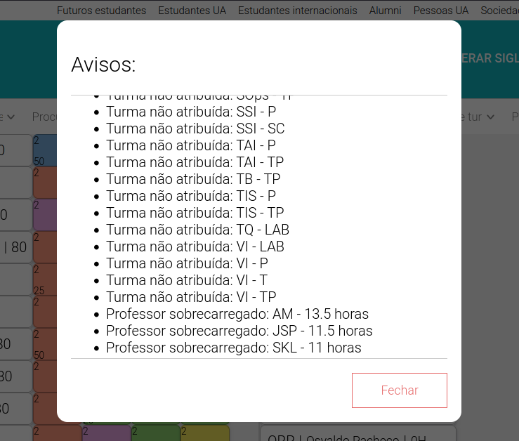

# Revisão e Validação do Estado Atual da DSD
A plataforma permite validar o estado atual da DSD elaborada pelo utilizador. A ferramenta de validação notifica o utilizador acerca dos seguintes problemas:
- Turmas sem um docente atribuído
- Docentes sobrecarregados



Esta validação pode ser feita a qualquer momento, clicando em **Validar** na *navbar* da aplicação. A função **validateDSD** faz um pedido *GET* onde recebe os docentes com horas superiores a um determinado limite (docentes sobrecarregados), apontando assim os seus nomes na *modal*. Esta função faz também um outro pedido *GET* onde recebe e guarda as turmas que não possuem nenhum docente.

```bash
<NavItem key='validar' onClick={validateDSD}>
  Validar
</NavItem>
```
