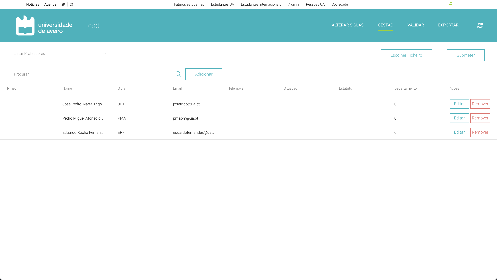
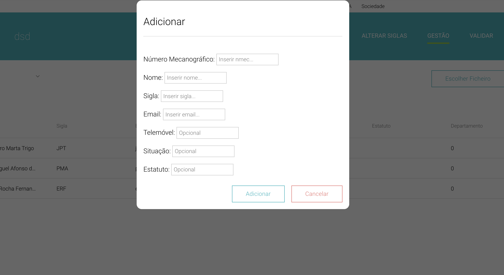

# Gerir listas de UCs e de docentes

Esta funcionalidade permite ao utilizador gerir todas as informações centrais do Sistema de Distruibuição do Serviço Docente. Para tal, é necessário navegar para a página *Gestão*, onde esta secção será mostrada.  
A tabela apresentada é retirada de uma libraria externa, *ag-grid-react*, que auxilia a plataforma neste processo de mostrar as entradas na base de dados.

Aqui é possível adicionar/remover/editar dados manualmente, bem como se pode introduzir dados através de um ficheiro csv.

Ao clicar no botão *Adicionar* é mostrado um *pop-up* com campos em branco onde o utilizador poderá introduzir uma nova entrada para a base de dados. Esta entrada tanto pode ser:
- um docente;
- uma UC;
- uma turma associada a uma UC;
- ou informação acerca de um docente gostar/não gostar de lecionar uma determinada UC (*wishlist*).

