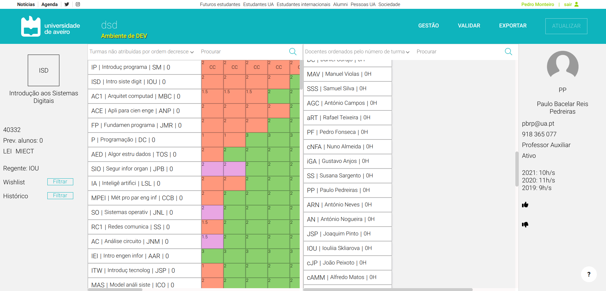

# Visão Geral



## Âmbito e Objetivo

O Sistema de Apoio à Distribuição do Serviço Docente é um projeto que tem como objetivo construir uma plataforma que facilite a realização de um processo complexo e demorado.

Esta plataforma vem para resolver problemas antigos, como complexidade e abstração da tarefa, facilitando este processo com ferramentas que o tornam mais prático e intuitivo para quem o executa.

## Instruções de configuração e instalação

Para correr este projeto localmente é necessário ter o Docker instalado.
Para mais informação, https://docs.docker.com/engine/install/ubuntu/

Linux
```bash
sudo apt-get update

sudo apt-get install docker-ce docker-ce-cli containerd.io docker-compose-plugin
```

MacOS <br></br>
Visitar https://docs.docker.com/desktop/install/mac-install/ para mais detalhes.

Para correr o projeto, abrir um terminal e correr os comandos abaixo
```bash
cd DSD/project/backend/DsdApi/_DOCKER_CONFIGS/  # caminho para o docker-compose

docker-compose up
```

1. Adicionar o WSO2 clientSecret em **DSD/project/backend/appsettings.Development.json**:
```
"clientSecret": "putyoursecrethere"
```

2. Inicializar o projeto correndo os seguintes comandos no teerminal:

```
cd DSD/project
docker-compose up
```

## Correr frontend e backend localmente para desenvolvimento rápido (Sem Docker)

1. Inicialmente, instalar as tecnologias descritas mais abaixo
2. Inicializar o Docker Container da Base de Dados:
```
cd DSD/project
docker-compose up sqlserver
```

3. Fazer build e correr o API:
```
cd DSD/project/backend

export ASPNETCORE_ENVIRONMENT=Development && export clientSecret=<REPLACEWITHSECRETHERE> && clear && dotnet clean DsdApi.csproj && dotnet build DsdApi.csproj && dotnet run
```

4. Instalar dependências e correr React:
```
cd DSD/project/frontend

yarn install
sudo yarn start # (sudo required to run on port 80)
```

### Tecnologias
- Frontend
  - React 17.0.2:
  - TypeScript 4.7.4

- Backend
  - ASP.NET Core 6
  - SQL Server
  - Docker